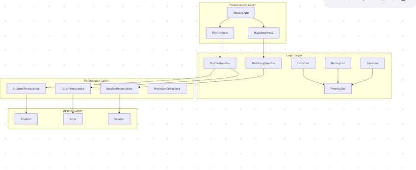

# SkolarD Architecture

SkolarD is a Java-based tutoring platform that helps post-secondary students book in-person tutoring sessions with peers. The system separates responsibilities using clear package structures and follows a layered design: **objects**, **logic**, and **persistence**.

---

## 🗂 Package Overview

```
skolard/
├── objects/         # Domain models: User, Tutor, Student, Session
├── logic/           # Application logic: Matching, Profiles, Filtering
├── persistence/     # Interfaces and factory for persistence
└── persistence/stub/ # In-memory stub implementations
```

---

## 📦 Package Responsibilities

### 1. `skolard.objects`
- **User.java** (abstract): Shared fields for Tutor and Student (`id`, `name`, `email`)
- **Student.java**: Tracks past/upcoming sessions
- **Tutor.java**: Stores courses taken, grades, and bio
- **Session.java**: Core scheduling unit between tutor and student

### 2. `skolard.logic`
- **MatchingHandler.java**: Matches students to sessions
- **ProfileHandler.java**: Manages profile data (view, update)
- **PriorityList.java**: Custom list with sorting/filtering logic
- **TutorList.java**: Sorts sessions by tutor rating
- **RatingList.java**: Sorts sessions by course-specific ratings
- **TimeList.java**: Filters sessions by time range

### 3. `skolard.persistence`
- **SessionPersistence.java**: Interface for session-related storage
- **TutorPersistence.java**: Interface for tutor-related storage
- **StudentPersistence.java**: Interface for student-related storage
- **PersistenceFactory.java**: Initializes appropriate data source (currently stub-based)

### 4. `skolard.persistence.stub`
- In-memory "fake database" implementations for:
  - **SessionStub.java**
  - **TutorStub.java**
  - **StudentStub.java**

---

## 🧠 System Architecture (Layered)



---

## 🧪 Test Coverage

Each major logic class has corresponding unit tests under:
```
skolard/logic/
├── ProfileHandlerTest.java
├── RatingListTest.java
├── TimeListTest.java
├── TutorListTest.java
├── PriorityListTest.java
```

---

## 🔄 Extensibility Notes

- In the future, `persistence/` can be extended with actual database implementations (e.g., using SQLite or PostgreSQL).
- Matching algorithms can be replaced or enhanced (e.g., by AI or priority queue).

---

## ✅ Summary

SkolarD’s architecture is designed to be clean, modular, and testable. It separates responsibilities into object modeling, logic processing, and persistence abstraction. This ensures long-term maintainability and ease of iteration.