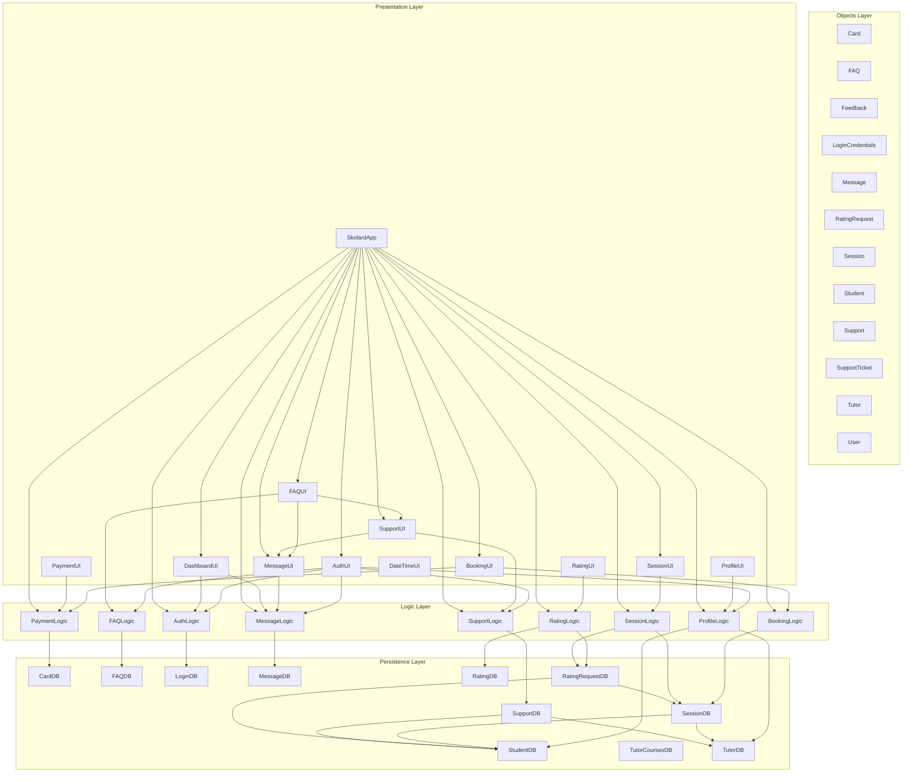

# Project Architecture

---

## Class Listings

### Object Classes
1. Card: no calls to other classes.  
2. FAQ: no calls to other classes.
3. Feedback: no calls to other classes.  
4. LoginCredentials: no calls to other classes.  
5. Message: no calls to other classes.  
6. RatingRequest: no calls to other classes.  
7. Session: no calls to other classes.  
8. Student: no calls to other classes.  
9. Support: no calls to other classes.  
10. SupportTicket: no calls to other classes.  
11. Tutor: no calls to other classes.  
12. User: no calls to other classes.  

### Persistence Layer Classes
- ConnectionManager: calls SchemaInitializer.
- DatabaseSeeder: no calls to other classes.  
- EnvironmentInitializer: no calls to other classes.   
- PersistenceFactory: no calls to other classes.   
- PersistenceProvider: calls all DB and Stub classes.  
- PersistenceRegistry: accesses all the Persistence interfaces.  
- PersistenceType(Enum): no calls to other classes. 
- CardDB: calls Card object.  
- FAQDB: calls FAQ object. 
- LoginDB:  accesses PasswordUtil.  
- MessageDB: accesses Message and MessageDB(and its stub) classes.
- RatingDB: accesses Feedback object.  
- RatingRequestDB: accesses RatingRequest, RatingRequestDB(and its stub), Session, SessionDB(and its stub), Student, and StudentDB(and its stub) classes.  
- SchemaInitializer: no calls to other classes.  
- SessionDB: accesses Session, Student, StudentDB(and its stub), Tutor, and TutorDB(and its stub) classes.
- StudentDB: accesses Student object.
- SupportDB: accesses Student, StudentDB(and its stub), Tutor, TutorDB(and its stub), and Support classes.  
- TutorCoursesDB: no calls to object classes.  
- TutorDB: accesses Tutor object.  

### Logic Layer Classes
- LoginHandler: accesses LoginCredentials, LoginDB(and its stub), PersistenceRegistry  
- BookingHandler: accesses Session, SessionDB(and its stub).  
- GradeComparator: accesses Session object  
- PriorityList:  
- TimeComparator: accesses Session object.  
- TutorComparator: accesses Session object.  
- FAQHandler: accesses FAQ and FAQDB(and its stub) classes.  
- MessageHandler: accesses Message, MessageUtil, MessageDB(and its stub) classes.
- PaymentHandler: accesses Card, Student, and CardDB(and its stub) classes.
- DefaultProfileFormatter: accesses User, Student, Tutor objects.
- ProfileCreator: Student, Tutor, StudentDB(and its stub), TutorDB(and its stub) classes.   
- ProfileHandler: accesses SessionHandler, Student, Tutor, User, StudentDB(and its stub), and TutorDB(and its stub) classes.  
- ProfileUpdater: accesses Student, Tutor, StudentDB(and its stub), and TutorDB(and its stub) classes.
- ProfileViewer:  accesses SessionHandler, Student, Tutor, User classes.
- RatingHandler: accesses Feedback, RatingRequest, Session, Student, Rating,and  RatingRequestDB(and its stub) classes.
- SessionAccess: accesses Session, Student, Tutor, and SessionDB(and its stub) classes. 
- SessionBooking: accesses Session, RatingRequestDB(and its stub), and SessionDB(and its stub) classes.  
- SessionHandler: accesses Session, Student, Tutor, RatingRequestDB(and its stub), and SessionDB(and its stub) classes.
- SessionManagement: Session, Tutor, Object, and SessionDB(and its stub) classes.  
- SupportHandler: accesses SupportTicket, and SupportDB(and its stub) classes.

### Presentation Layer Classes
- LoginView: accesses LoginHandler, FAQHandler, MessageHandler, ProfileHandler, SupportHandler, LoginCredentials, Support, User, PersistenceRegistry, SkolardApp, SupportDashboard, and FAQView classes.  
- SignUpView: accesses LoginHandler, FAQHandler, ProfileHandler, Student, Tutor, PersistenceRegistry, SkolardApp, FAQView, and PasswordUtil classes.  
- BookingController: accesses RatingHandler, SessionHandler, BookingHandler, PaymentHandler, Session, Student, and PaymentView classes. 
- BookingInputHandler: accesses BookingHandler, BookingHandler, SessionFilter, Session, Student, and CourseUtil classes.
- BookingView: accesses RatingHandler, SessionHandler, BookingHandler, PaymentHandler,Session, Student, and PaymentView classes.  
- SupportDashboard: accesses MessageHandler, SupportHandler, MessageView, and SupportView classes.  
- TutorView: accesses MessageHandler, ProfileHandler, SessionHandler, Session, Student, and Tutor classes.  
- DateTimeLabel: doesn't call any project class.
- FAQView: accesses FAQ and FAQHandler classes. 
- MessageView: accesses MessageHandler, Message, Student, and Tutor, and User classes.
- PaymentView: accesses Card, Student, PaymentHandler classes. 
- StudentProfileView: accesses Card, Student, and PaymentHandler classes.
- TutorProfileView: accesses FAQ, BookingHandler, MessageHandler, PaymentHandler, ProfileHandler, RatingHandler, SessionHandler, SupportHandler, Student, PersistenceRegistry, FAQView, BookingView, MessageView, RatingView, and SupportView classes. 
- RatingView: accesses RatingHandler, RatingRequest, Session, and Student classes.
- SessionView: accesses SessionHandler, Session, Student, Tutor, User, and CourseUtil classes. 
- SupportView: accesses MessageHandler, SupportHandler, Message, SupportTicket, User, and PersistenceRegistry classes.
- SkolardApp:  accesses FAQHandler, LoginHandler, BookingHandler, MessageHandler, ProfileHandler, RatingHandler, SessionHandler, SupportHandler, Student, Support, Tutor, User, PersistenceRegistry, LoginView, SignUpView, FAQView, BookingView, SessionView, MessageView, SupportView, RatingView, and TutorView classes.

