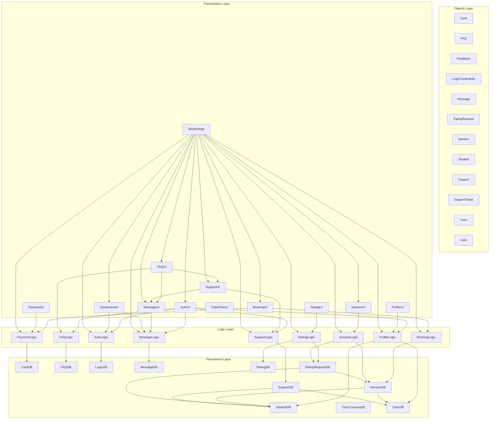

# Project Architecture

---

## Class Listings

### Object Classes
1. Card: no calls to other classes  
2. FAQ: no calls to other classes
3. Feedback: no calls to other classes  
4. LoginCredentials: no calls to other classes  
5. Message: no calls to other classes  
6. RatingRequest: no calls to other classes  
7. Session: no calls to other classes  
8. Student: no calls to other classes  
9. Support: no calls to other classes  
10. SupportTicket: no calls to other classes  
11. Tutor: no calls to other classes  
12. User: no calls to other classes  

### Persistence Layer Classes
- ConnectionManager: calls SchemaInitializer
- DatabaseSeeder  
- EnvironmentInitializer  
- PersistenceFactory  
- PersistenceProvider: calls all DB classes  
- PersistenceRegistry: accesses all the Persistence interfaces  
- PersistenceType(Enum): no calls to other classes 
- CardDB: calls Card object  
- FAQDB:  calls FAQ object 
- LoginDB:  accesses PasswordUtil  
- MessageDB: accesses  
- RatingDB: accesses Feedback object  
- RatingRequestDB: accesses RatingRequest, RatingRequestDB, Session, SessionDB, Student, and StudentDB classes.  
- SchemaInitializer: no calls to other classes  
- SessionDB: accesses Session, Student, StudentDB, Tutor, and TutorDB classes
- StudentDB: accesses Student object
- SupportDB: accesses Student, StudentDB, Tutor, TutorDB, and Support classes  
- TutorCoursesDB: no calls to object classes  
- TutorDB: accesses Tutor object  

### Logic Layer Classes
- LoginHandler  
- BookingHandler  
- GradeComparator  
- PriorityList  
- TimeComparator  
- TutorComparator  
- FAQHandler  
- MessageHandler  
- PaymentHandler  
- DefaultProfileFormatter  
- ProfileCreator  
- ProfileFormatter  
- ProfileHandler  
- ProfileUpdater  
- ProfileViewer  
- RatingHandler  
- SessionAccess  
- SessionBooking  
- SessionHandler  
- SessionManagement  
- SupportHandler  

### Presentation Layer Classes
- LoginView  
- SignUpView  
- BookingController  
- BookingInputHandler  
- BookingView  
- SupportDashboard  
- TutorView  
- DateTimeLabel  
- FAQView  
- MessageView  
- PaymentView  
- StudentProfileView  
- TutorProfileView  
- RatingView  
- SessionView  
- SupportView  
- SkolardApp  

