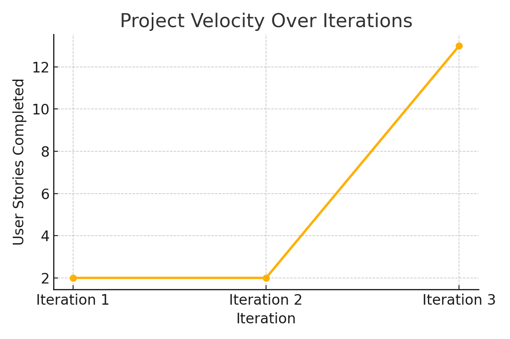

# Iteration 3 Retrospective

## Area of Concern: Messaging System Design

One feature that did not meet expectations during the previous iteration was the messaging system. At present, the messaging interface requires users to manually input both the tutor’s and student’s email addresses in order to display messages. This workflow is unintuitive and does not reflect a realistic user experience for direct communication. Additionally, our current setup does not simulate a real conversation between two users, as both message sender and recipient have to be entered manually.

This design flaw limits usability and makes testing the feature cumbersome. We realized that the messaging interface does not align with our goal of making communication feel seamless and natural, particularly in a student-tutor environment where pairing should already be known based on session history or matching.

## Planned Improvements

To address these issues, we will redesign the messaging interface with the following concrete changes:

1. **User Context Detection**: Automatically detect the logged-in user (either student or tutor) using casting or instance checking.
2. **Recipient Selection**: Provide a dynamic list of relevant users (e.g., students matched with a tutor or tutors from past sessions of a student).
3. **Simplified UI**: Replace manual email input with a clickable list of contacts that loads the corresponding message thread.
4. **Message Simulation**: Implement a refresh or polling mechanism that allows simultaneous chat simulation (e.g., by running two user windows).

These updates aim to improve the overall usability and simulate real-time communication more effectively during testing.

## Evaluation Criteria

We will consider this improvement successful if the following measurable outcomes are met by the end of the iteration:

- Logged-in users can send messages without entering their own email.
- Recipient selection is available via a dynamic contact list.
- Messages appear correctly for both users when running parallel windows.
- Refresh/polling works as intended to simulate a chat experience.

This will be verified through a live test with two running user interfaces and will be documented in our next demo session.

## Velocity Chart

Below is the chart showing our team’s velocity over the last two iterations:

---
