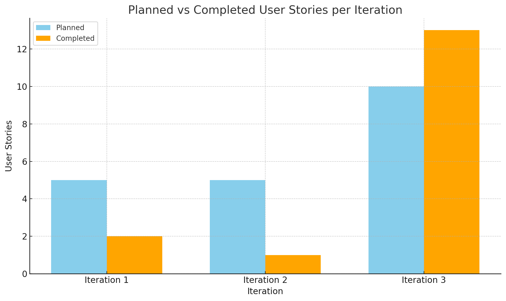

# Iteration 3 Retrospective

## Area of Concern: Messaging System Design

During the previous iteration, our messaging system did not meet the team's expectations. Currently, the messaging interface requires users to manually input both the tutor's and student's email addresses each time they wish to view or send messages. This approach is unintuitive and diverges significantly from typical user experiences involving direct messaging systems. Additionally, our existing implementation fails to effectively simulate realistic conversations between users, as both the sender and recipient fields must be manually populated every time a message is sent or viewed.

This limitation severely restricts usability and complicates thorough testing. It became apparent that our current messaging system does not align with our overarching objective of providing seamless, intuitive communication between students and tutors—especially given that the platform inherently involves predetermined pairings established through session bookings or matching mechanisms.

## Prioritization of Messaging System

During our retrospective discussions, the team unanimously agreed to prioritize enhancing the messaging system in this iteration. We acknowledged messaging as a foundational component of our platform, essential to its primary function of effectively connecting students and tutors. Without a smooth and intuitive messaging interface, the user experience is significantly diminished, potentially hindering session coordination, feedback, and overall user satisfaction.

From a development standpoint, refining the messaging system will also facilitate improvements in interconnected features, such as session management, rating, and support interactions. Our team resolved to tackle this issue proactively and collaboratively at the start of the current iteration, allocating dedicated resources for both backend improvements and frontend refinements to achieve optimal functionality and user experience.

## Planned Improvements

To rectify these concerns, we have identified specific and concrete improvements:

1. **User Context Detection**: Automatically determine the logged-in user's role (student or tutor) through instance checking and casting, eliminating the need to manually input one's own details.
2. **Recipient Selection**: Present a dynamic list of relevant contacts based on existing matches or historical session interactions, enabling users to quickly select recipients without manual input.
3. **Enhanced User Interface (UI)**: Replace the manual entry of email addresses with a clickable list of contacts that directly opens the corresponding message threads, significantly streamlining the user experience.
4. **Real-time Messaging Simulation**: Implement an effective polling or refresh mechanism to simulate real-time messaging, facilitating parallel message views in separate user sessions during testing.

These targeted enhancements aim to significantly boost usability and enable more realistic, effective testing scenarios.

## Evaluation Criteria

The success of these improvements will be objectively evaluated based on the following measurable outcomes at the conclusion of this iteration:

- Users no longer need to manually input their own email addresses when sending messages.
- A dynamically populated list of relevant recipients is readily available and functional.
- Message threads load correctly and intuitively upon contact selection.
- The messaging system accurately simulates real-time conversations in parallel user sessions, with functional message refresh or polling.

## Velocity Chart

Below is the updated velocity chart illustrating our team's performance across the last two iteration

---
